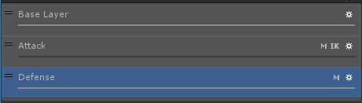
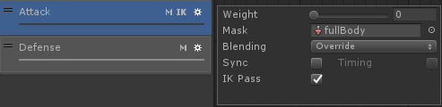
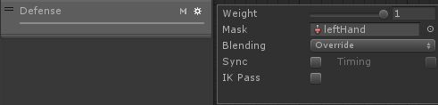
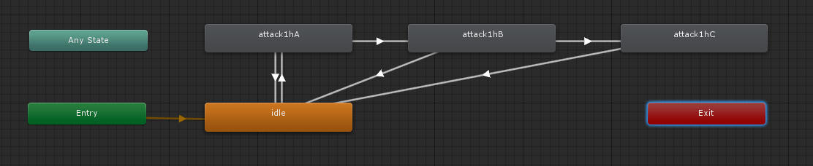
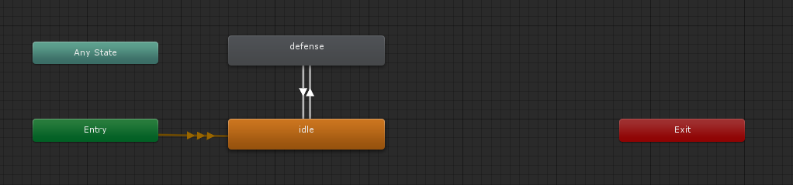
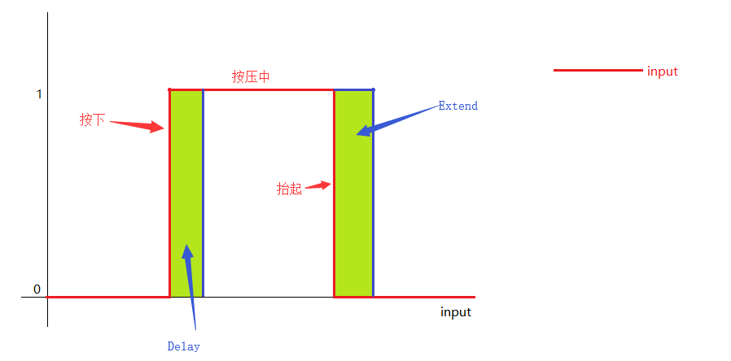
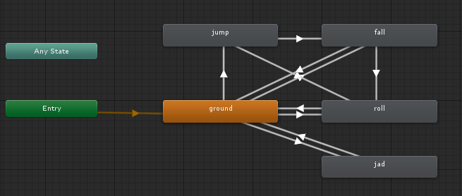

# Unity_DarkSoul

#### Attack && Defense








Attack的AvatarMask为fullBody，权重直接设置影响Base Layer动画播放，故依靠脚本设置

Defense权重AvatarMask为leftHand，权重直接设为1，不影响其他层动画播放





#### Abstract Input Class

```C#
using UnityEngine;

/// <summary>
/// 用户输入抽象类
/// </summary>
public abstract class AbstractInput : MonoBehaviour
{
    [Header("----- Additional Button Setting -----")]//额外按键设置（可自定义）
    public KeyCode keyA = KeyCode.LeftShift;
    public KeyCode keyB = KeyCode.Space;//对应跑步、跳跃、翻滚、后跳
    public KeyCode keyC = KeyCode.J;//对应攻击
    public KeyCode keyD = KeyCode.K;//对应举盾

    //用于监听对应按键的状态
    protected MyButton buttonA = new MyButton();
    protected MyButton buttonB = new MyButton();
    protected MyButton buttonC = new MyButton();
    protected MyButton buttonD = new MyButton();

    [Header("----- Output Signals -----")]//输出信号
    public float Dup;
    public float Dright;//用于控制角色移动的信号
    public float Jup;
    public float Jright;//用于控制相机视野的信号
    public float Dmagnitude;//角色移动程度
    public Vector3 Ddirection;//角色移动方向

    //1.pressing signal
    public bool run;//是否跑步
    public bool defense;//是否举盾
    //2.trigger once signal
    public bool attack;//攻击信号
    public bool roll;//翻滚信号
    //3.double trigger
    public bool jump;//跳跃信号

    [Header("----- Component Activate -----")]
    public bool inputEnable = true;//脚本是否可用

    //根据不同输入有不同的设置目标Dup、Dright的方法，写在子类中
    protected float targetDup;
    protected float targetDright;

    //Dup->targetDup、Dright->targetDright缓冲过渡使用
    protected float velocityDup;
    protected float velocityDright;

    //SquareToCircle方法中间变量
    protected Vector2 tempDAxis;
    protected float tempDup;
    protected float tempDright;
    //上述7个变量是角色移动输入转输出的中间变量

    /// <summary>
    /// 将输入的方形坐标转成球形坐标
    /// 解决Bug：斜向移动时playerInput.Dmagnitude最大为根号2,直行时 
    /// playerInput.Dmagnitude最大为1,造成移动速度不一致
    /// </summary>
    /// <param name="input">输入坐标</param>
    /// <returns>输出坐标</returns>
    protected Vector2 SquareToCircle(Vector2 input)
    {
        Vector2 output = new Vector2(input.x * Mathf.Sqrt(1 - (input.y * input.y) / 2.0f),
            input.y * Mathf.Sqrt(1 - (input.x * input.x) / 2.0f));
        return output;
    }

    /// <summary>
    /// 额外输入按钮控制
    /// </summary>
    protected void ButtonControl()
    {
        #region Button Controll
        buttonB.Tick(Input.GetKey(keyB));

        run = (buttonB.isPressing && !buttonB.isDelaying) || buttonB.isExtending;
        jump = buttonB.onPressed && buttonB.isExtending;
        roll = buttonB.isDelaying && buttonB.onReleased;

        attack = Input.GetKeyDown(keyC);
        defense = Input.GetKey(keyD);
        #endregion
    }


    /// <summary>
    /// 是否开启该脚本
    /// </summary>
    protected void ComponentIsActivate()
    {
        if (!inputEnable)
        {
            targetDup = 0;
            targetDright = 0;
        }
    }

    /// <summary>
    /// 角色移动输入转输出
    /// </summary>
    protected void InputToOutput()
    {
        Dup = Mathf.SmoothDamp(Dup, targetDup, ref velocityDup, 0.1f);
        Dright = Mathf.SmoothDamp(Dright, targetDright, ref velocityDright, 0.1f);

        //解决Bug：斜向移动时playerInput.Dmagnitude最大为根号2,直行时playerInput.Dmagnitude最大为1,造成移动速度不一致
        tempDAxis = SquareToCircle(new Vector2(Dright, Dup));
        tempDup = tempDAxis.y;
        tempDright = tempDAxis.x;

        //计算到原点之间的距离（适用于摇杆）
        //Bug：斜向移动时playerInput.Dmagnitude最大为根号2,直行时playerInput.Dmagnitude最大为1,造成移动速度不一致
        //Dmagnitude = Mathf.Sqrt((Dup * Dup) + (Dright * Dright));
        Dmagnitude = Mathf.Sqrt((tempDup * tempDup) + (tempDright * tempDright));
        //计算前进的方向
        Ddirection = tempDright * transform.right + tempDup * transform.forward;
    }
}
```


#### Timer Class

```C#
using UnityEngine;

/// <summary>
/// 计时器类（配合Button类使用）
/// </summary>
public class MyTimer {

    public enum STATE//计时器的状态
    {
        IDLE,//计时器闲置
        RUN,//计时中
        FINISHED//计时结束
    }

    public STATE state;//计时器的当前状态
    public float duration = 1.0f;//计时器持续时间（state处于RUN的时间）

    private float elapsedTime = 0;//计时开始后，流逝的时间

    public void Tick()//在Update中调用计时
    {
        switch(state)
        {
            case STATE.IDLE:
            case STATE.FINISHED:
                break;
            case STATE.RUN:
                elapsedTime += Time.deltaTime;
                if (elapsedTime >= duration)//当流逝的时间大于计时持续时间，计时结束
                    state = STATE.FINISHED;
                break;
        }
    }

    public void Go()//开启计时器
    {
        elapsedTime = 0;//流逝的时间归0
        state = STATE.RUN;//计时器开始运行
    }
}

```


#### Button Class

```C#
/// <summary>
/// Button类（各种Button状态）
/// </summary>
public class MyButton {
    public bool isPressing = false;//Button按压中
    public bool onPressed = false;//Button按下
    public bool onReleased = false;//Button抬起
    public bool isDelaying = false;//Button按下后的一段延迟时长
    public bool isExtending = false;//Button抬起后的一段扩展时长

    public float extendingDuration = 0.15f;//扩展时长
    public float delayingDuration = 0.15f;//延迟时长

    private bool lastState;//上一Button状态
    private bool currentState;//当前Button状态

    private MyTimer extendingTimer = new MyTimer();//扩展时长计时器
    private MyTimer delayingTimer = new MyTimer();//延迟时长计时器

    //input为Input.GetKey（KeyCode）或Input.GetButton（ButtonName）
    public void Tick(bool input)//在Update中调用监听Button状态
    {
        //计时器状态监听
        extendingTimer.Tick();
        delayingTimer.Tick();

        currentState = input;//当前状态为input
        isPressing = currentState;//Button按压中

        onPressed = false;
        onReleased = false;

        if (currentState!=lastState)//当前状态与上一状态不符，Button按下或抬起
        {
            if (currentState)//当前状态为true，Button按下
            {
                onPressed = true;//Button按下
                StartTimer(delayingTimer, delayingDuration);//延迟计时器开启计时
            }
            else//当前状态为false，Button抬起
            {
                onReleased = true;//Button抬起
                StartTimer(extendingTimer, extendingDuration);//扩展计时器开始计时
            }
        }
        //扩展计时器计时过程中，isExtending为true
        isExtending = (extendingTimer.state == MyTimer.STATE.RUN);
        //延迟计时器计时过程中，isExtending为true
        isDelaying = (delayingTimer.state == MyTimer.STATE.RUN);
        lastState = currentState;
    }

    private void StartTimer(MyTimer timer, float duration)//开始计时
    {
        timer.duration = duration;//设置计时器的计时时长
        timer.Go();//开启计时器
    }

}

```



修改：Jab、Roll、Run、Jump方式（一键控制）

```C#
    public KeyCode keyB = KeyCode.Space;//对应跑步、跳跃、翻滚、后跳
    private MyButton buttonB = new MyButton();
	//1.pressing signal
    public bool run;//是否跑步
    //2.trigger once signal
    public bool roll;//翻滚信号
    //3.double trigger
    public bool jump;//跳跃信号

private void Update()
{
	buttonB.Tick(Input.GetKey(keyB));

    //延迟时间内，抬起keyB，进入roll状态
    roll = buttonB.isDelaying && buttonB.onReleased;
    //keyB按住过程中，延迟时长过后进入run状态，扩展时间内仍为run状态
    run = (buttonB.isPressing && !buttonB.isDelaying) || buttonB.isExtending;
    //keyB扩展时间内再次按下keyB进入jump状态
    jump = buttonB.onPressed && buttonB.isExtending;
}
```
动画状态机如下：



若没有速度，进入roll状态，播放jad动画，若有速度，进入roll状态，播放roll动画